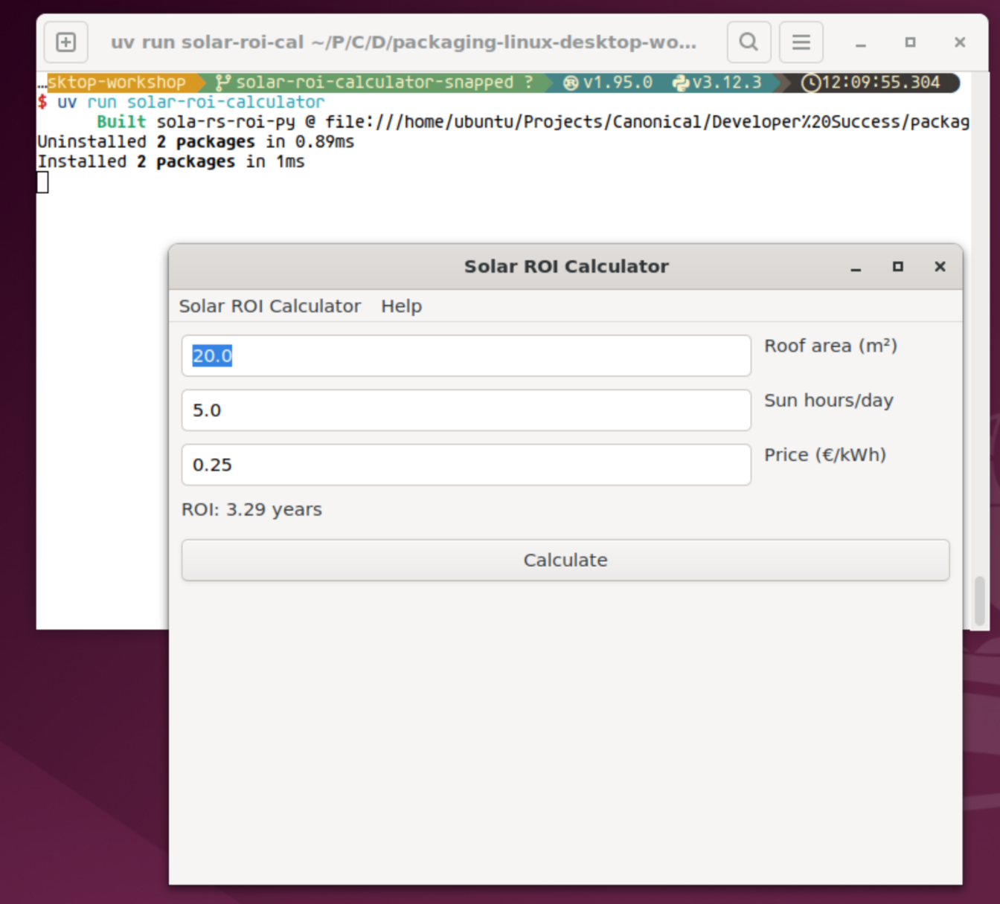

### 3. Cross-platform GUIs with Toga

The background script should have launched a VNC session already.
To be able to use a graphical session,
launch noVNC to bridge VNC (5901) to Web (6080):

`/usr/share/novnc/utils/novnc_proxy --vnc localhost:5901 --listen 6080`{{exec}}

Once the setup is complete, you can access the graphical environment here:
[Open VNC Desktop]({{TRAFFIC_HOST1_6080}}/vnc.html?autoconnect=true)

**The password is `password`**.

If you have trouble, you can also manually select the port here: [Access Ports]({{TRAFFIC_SELECTOR}})

---

- Add `toga` to the `gui` optional list of dependencies: `cd ~/test-app && uv add toga --optional gui`{{exec}}
- Create a new `src/test_app/__main__.py` with these contents:

```python
# __main__.py
import toga


def main() -> None:
    app = toga.App(
        "Test Toga App",
        "com.canonical.test-toga-app",
        startup=lambda app: toga.Box(),
    )
    app.main_loop()
```

- Add a new CLI entry point to `pyproject.toml` so that the table looks as follows:

```toml
[project.scripts]
test-app = "test_app:main"
test-app-gui = "test_app.__main__:main"
```

- **On the graphical session**, test that `uv run test-app-gui` launches a blank GUI application

#### Exercise

Apply what you have learned so far to package an existing Python app
lacking metadata and a proper directory structure.

For that,

- `git clone -b solar-roi-calculator-raw --single-branch https://github.com/astrojuanlu/packaging-linux-desktop-workshop.git ~/app-raw`{{exec}}
- You will see an `app.py`. It works, but you will need to
  manually create a virtual environment and install the missing dependencies.
  Not nice.
- Create a proper directory structure,
  inspired by the dummy application we created earlier,
  until `uv run solar-roi-calculator`{{exec}} works.
- **Extra points**: Use the Rust version in `lib.rs` instead of `lib.py`.

Tip: You can use the VSCode-like editor in Killercoda, see the tab on top.

The result should look something like this:


